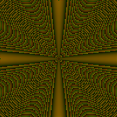
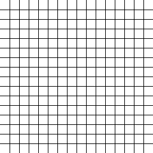

# libbmp
Pure JS implementation for the bmp image format

## Example usage
```js
const width = 50;
const height = 50;
const bmpImage = new BMPImage(width, height, 300);
const midPoint = Math.floor((width/2 + height/2) / 2);
const dist = (x, y) => Math.sqrt((x - midPoint)**2 + (y - midPoint)**2);

for (let y = 0; y < height; y++) {
  for (let x = 0; x < width; x++) {
    const distColor = ((midPoint - dist(x, y)) * 255) % 256;
    if (x % 2 == 1 && y % 2 == 1) {
      bmpImage.setPixel(x, y, distColor, distColor, 0);
    } else if (x % 2 == 0 && y % 2 == 0) {
      bmpImage.setPixel(x, y, distColor, 100, 0);
    } else {
      bmpImage.setPixel(x, y, 0, 0, 0);
    }
  }
}

await fsp.writeFile("image.bmp", bmpImage.toBuffer());
```



```js
const width = 256;
const height = 256;
const bmpImage = new BMPImage(width, height);

for (let y = 0; y < height; y++) {
  for (let x = 0; x < width; x++) {
    bmpImage.setPixel(x, y, 255, 255, 255);
  }
}

const gridWidth = 16;
const gridHeight = 16;
const gridColor = [0, 0, 0];

for (let x = 1; x < Math.ceil(width / gridWidth); x++) {
  for (let y = 0; y < height; y++) {
    bmpImage.setPixel(x * gridWidth, y, ...gridColor);
  }
}

for (let y = 1; y < Math.ceil(height / gridHeight); y++) {
  for (let x = 0; x < width; x++) {
    bmpImage.setPixel(x, y * gridHeight, ...gridColor);
  }
}

await fsp.writeFile("image.bmp", bmpImage.toBuffer());
```




## Notes:
- [ ] add support for alpha channel, 32 bit per pixel
- [ ] add automated testing

## Resources
- https://www.ece.ualberta.ca/~elliott/ee552/studentAppNotes/2003_w/misc/bmp_file_format/bmp_file_format.htm
- https://www.martinreddy.net/gfx/2d/BMP.txt
- https://paulbourke.net/dataformats/bitmaps/
- https://stackoverflow.com/questions/8482309/converting-javascript-integer-to-byte-array-and-back
